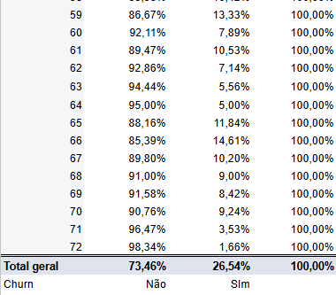

# Análise de Churn  
Projeto de análise de churn realizado no Google Sheets, explorando hipóteses e insights de negócio.

---

## Hipóteses e Resultados da Análise

### Hipótese 1: O primeiro mês é o mais crítico para o cliente entrar em churn?

**Resultado: Verdadeiro**  
A análise mostrou que os três primeiros meses após a compra concentram as maiores taxas de churn:

- 1º mês: pico mais alto de cancelamentos  
- Até o 3º mês: churn ainda se mantém elevado  
- A partir do 3º mês: começa a se estabilizar  
- Após o 6º mês: queda significativa no churn, indicando início da fidelização  

**Insight:** os três primeiros meses são cruciais para a retenção do cliente, exigindo maior atenção e esforço em ações de engajamento.

---

### Hipótese 2: A taxa de churn da empresa é de 30%?

**Resultado: Parcialmente verdadeiro**  
O cálculo considerando todos os clientes desde a primeira compra até hoje mostrou uma taxa de 26,54%, abaixo dos 30% estimados, mas ainda próxima.

**Insight:** a taxa de churn total gira em torno de 26% — ou seja, aproximadamente 1 em cada 4 clientes cancela. Apesar de ser menor que 30%, é um valor relevante para monitorar e planejar estratégias de retenção.

---

### Hipótese 3: A taxa de churn ao longo do tempo de ativação é crescente?

**Resultado: Falso**  
Os dados indicam o contrário:  

- Nos primeiros meses: taxa é alta  
- A partir do 3º mês: estabiliza  
- Após o 6º mês: cai de forma acentuada  

**Insight:** quanto mais tempo o cliente permanece, menor a chance de cancelamento.  
Isso mostra que esforços de retenção nos primeiros meses trazem retorno no longo prazo.

---

### Hipótese 4: A maior taxa de churn ocorre em clientes que pagam por boleto?

**Resultado: Verdadeiro**  
O método de pagamento por boleto apresenta as maiores taxas de churn.

**Insight:** clientes que utilizam boleto têm maior probabilidade de cancelar, principalmente nos primeiros anos.  
A empresa pode reduzir o churn incentivando ou migrando esses clientes para métodos de pagamento alternativos, além de monitorar de perto os clientes em boleto nos primeiros meses.

---

## Conclusões Gerais

- Os três primeiros meses após a compra são o período mais crítico e devem receber esforços concentrados de retenção.  
- Se o cliente permanecer até o sexto mês, a probabilidade de churn cai consideravelmente.  
- A empresa deve rever a política de pagamento via boleto, já que esse meio está associado a maior risco de cancelamento.

